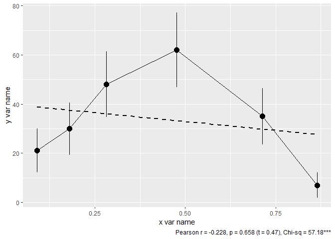
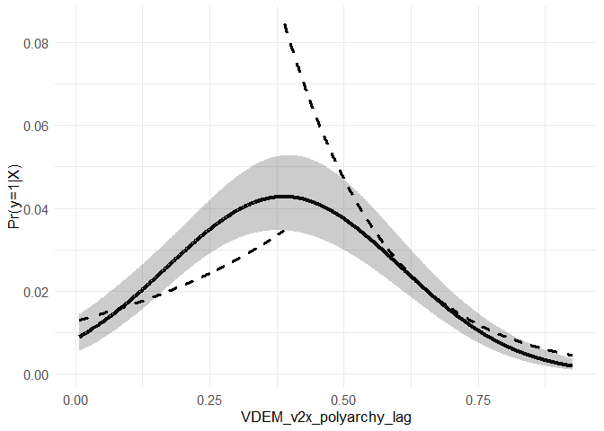

<!-- README.md is generated from README.Rmd. Please edit that file -->

# csra

<!-- badges: start -->
<!-- badges: end -->

csra is a package with functions used by
[CSRA](https://social.hse.ru/mr/) staff analyzing political events

## Installation

You can install the development version of csra from
[GitHub](https://github.com/) with:

``` r

# install.packages("devtools")
devtools::install_github("vadvu/csra")
```

## Example

This is a basic example which shows you how the main function
“equalparts” works:

``` r
library(csra)
#> Warning: заменяю предыдущий импорт 'dplyr::filter' на 'stats::filter' во время
#> загрузки 'csra'
#> Warning: заменяю предыдущий импорт 'dplyr::lag' на 'stats::lag' во время
#> загрузки 'csra'
data <- data("dataex") #it's an example panel data that you can use

#Now let's try to analyze how VDEM democracy index affects revolutionary situations
equalparts(
  data = datex, #our data
  independent = 'VDEM_v2x_polyarchy', #independent var
  lag_independent = T, #Should it be lagged? Yea because political regime can change gramatically during revolutionary year
  lag_code = "iso3", #by what unit lag is realized
  lead = T, #due to specific of data (in the top we have earlier data - 2019, 2018, 2017, ...) lead should be used. Otherwise, False is needed
  dependent = 'NVC_1.3_NONVIOL', #dependent var
  n = 6, #number of equal parts. If n = 10, it is decile analysis, 4 - quartile analysis and etc
  bar_or_scatter = 'scatter', #plot type, scatter is more powerful
  regline = TRUE, #linear regression line
  return_data = FALSE, #we want to see plot, so we do not need data
  conf_bars = TRUE, #95%CI
  range_bars = FALSE, #range (max-min) of independent var in each unit (for ex., decile)
  save_plot = FALSE #we do not want to save plot, so its False
)
```


Plot that is returned by default can be easily changed by ggplot2
syntax. Just save function output and add to it ggplot2 blocks:

``` r
library(csra)
library(ggplot2)
data <- data("dataex")

plot <- equalparts(
  data = datex,
  independent = 'VDEM_v2x_polyarchy',
  lag_independent = T,
  lag_code = "iso3",
  lead = T,
  dependent = 'NVC_1.3_NONVIOL',
  n = 6,
  bar_or_scatter = 'scatter',
  regline = TRUE,
  return_data = FALSE,
  conf_bars = TRUE,
  range_bars = FALSE,
  save_plot = FALSE
)

# for ex., change axis names and theme
plot + xlab("x var name") + ylab("y var name") + theme_grey()
```



Also table with results can be returned, just set return_data = TRUE:

``` r
library(csra)
library(ggplot2)
data <- data("dataex")

equalparts(
  data = datex,
  independent = 'VDEM_v2x_polyarchy',
  lag_independent = T,
  lag_code = "iso3",
  lead = T,
  dependent = 'NVC_1.3_NONVIOL',
  n = 6,
  bar_or_scatter = 'scatter',
  regline = TRUE,
  return_data = TRUE, #here
  conf_bars = TRUE,
  range_bars = FALSE,
  save_plot = FALSE
)
#>    parts Freq_0 Freq_1      means   min   max  prc5 prc95     low95CI
#> 7      1   1592     21 0.09029262 0.008 0.145 0.016 0.143 0.007487174
#> 8      2   1583     30 0.17917483 0.145 0.214 0.149 0.210 0.012005542
#> 9      3   1565     48 0.28196590 0.214 0.362 0.220 0.354 0.021465775
#> 10     4   1551     62 0.47658215 0.362 0.600 0.372 0.588 0.029055460
#> 11     5   1578     35 0.71369994 0.601 0.814 0.613 0.801 0.014588331
#> 12     6   1605      7 0.86508437 0.814 0.926 0.820 0.907 0.001132506
#>       high95CI
#> 7  0.018551264
#> 8  0.025192226
#> 9  0.038050654
#> 10 0.047819928
#> 11 0.028809065
#> 12 0.007552358
```

Another function that is in DEMO stage now - U_shape_test. It is needed
to detect hump-shaped form of links. Now only rare events logistic model
has been implemented now (but the logic is suit for all glm)

``` r
library(csra)
data <- data("dataex")

U_shape_test(
  data = datex, #our data
  dep_var = "NVC_1.3_NONVIOL", #dependent variable
  ind_var = "VDEM_v2x_polyarchy_lag", #independent var
  control_vars = c("UN_Total_Population_log", "UN_Median_Age"), #control vars
  boot = TRUE, #bootstrap for middle point analysis
  vcov_type = "HC", #type of SE
  n = 10, #number of bootstraps. Too small in this example
  save_plot = FALSE, #we do not need to save plot
  save_table = FALSE #we do not need to save regression table
)
#> [1] "data looks ok"
#> [1] "GAM vs polynomial term p-value: 1"
#> [1] "ggpredict"
#> 
#> ========================================================
#>                                 Dependent variable:     
#>                            -----------------------------
#>                                                         
#> --------------------------------------------------------
#> VDEM_v2x_polyarchy_lag               8.544***           
#>                                       (1.329)           
#> I(VDEM_v2x_polyarchy_lag2)          -10.989***          
#>                                       (1.462)           
#> UN_Total_Population_log              0.351***           
#>                                       (0.045)           
#> UN_Median_Age                        0.044***           
#>                                       (0.011)           
#> Constant                             -8.941***          
#>                                       (0.519)           
#> --------------------------------------------------------
#> U-shape test:                                           
#> ....Extreme point             0.389 [ 0.036 - 0.826 ]   
#> ....Slope at Xlower                   2.62***           
#> ....Slope at Xhigher                 -5.62***           
#> GAM test:                                               
#> ....GAM edf                           3.16***           
#> ....ANOVA p-value                        1              
#> Nobs                                   8400             
#> AIC                                   1768.79           
#> ========================================================
#> Note:                      *p<0.05; **p<0.01; ***p<0.001
#> [[1]]
#>  [1] ""                                                        
#>  [2] "========================================================"
#>  [3] "                                Dependent variable:     "
#>  [4] "                           -----------------------------"
#>  [5] "                                                        "
#>  [6] "--------------------------------------------------------"
#>  [7] "VDEM_v2x_polyarchy_lag               8.544***           "
#>  [8] "                                      (1.329)           "
#>  [9] "I(VDEM_v2x_polyarchy_lag2)          -10.989***          "
#> [10] "                                      (1.462)           "
#> [11] "UN_Total_Population_log              0.351***           "
#> [12] "                                      (0.045)           "
#> [13] "UN_Median_Age                        0.044***           "
#> [14] "                                      (0.011)           "
#> [15] "Constant                             -8.941***          "
#> [16] "                                      (0.519)           "
#> [17] "--------------------------------------------------------"
#> [18] "U-shape test:                                           "
#> [19] "....Extreme point             0.389 [ 0.036 - 0.826 ]   "
#> [20] "....Slope at Xlower                   2.62***           "
#> [21] "....Slope at Xhigher                 -5.62***           "
#> [22] "GAM test:                                               "
#> [23] "....GAM edf                           3.16***           "
#> [24] "....ANOVA p-value                        1              "
#> [25] "Nobs                                   8400             "
#> [26] "AIC                                   1768.79           "
#> [27] "========================================================"
#> [28] "Note:                      *p<0.05; **p<0.01; ***p<0.001"
#> 
#> [[2]]
```


